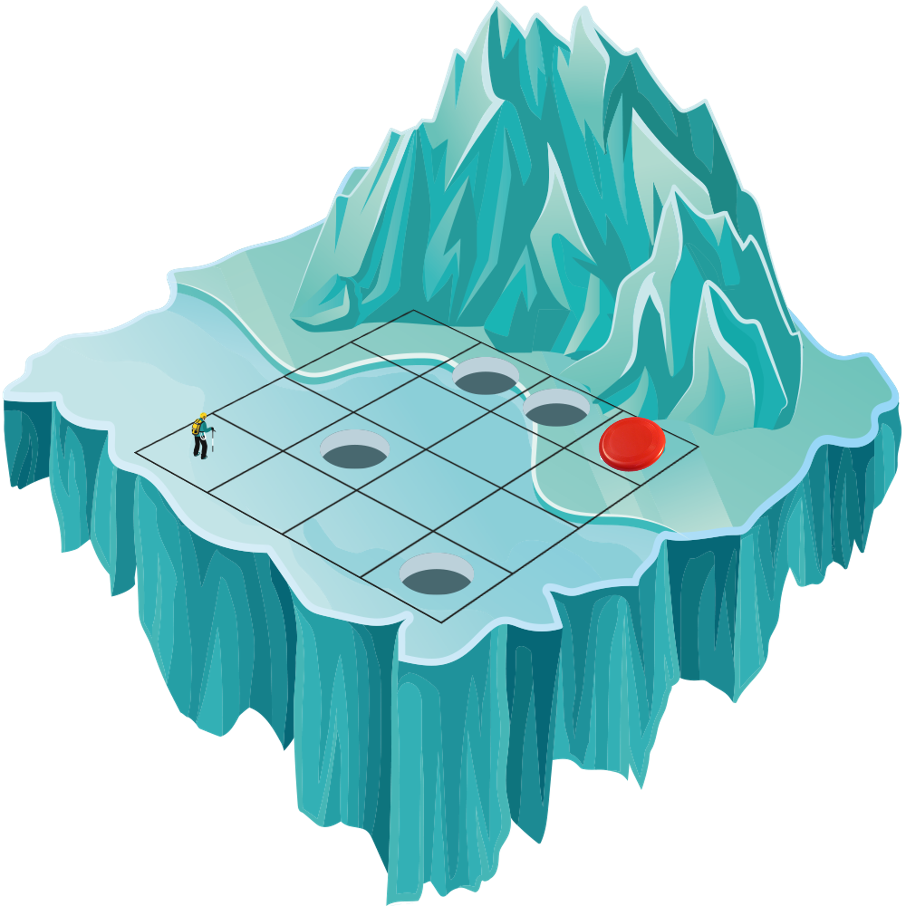
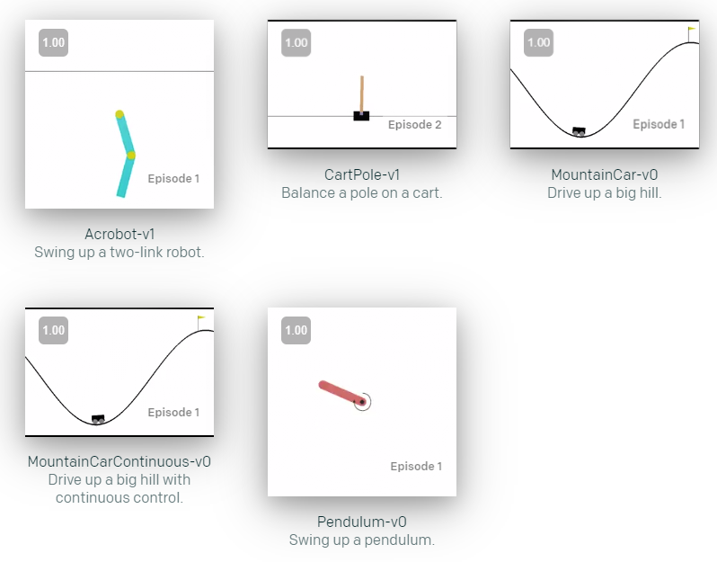

# Reinforcement Learning Homework

## Part 1: Basic Q-learning using Frozen Lake environment (2.5 points)

OpenAI created a library called [gym](https://gym.openai.com/envs/#classic_control), which provides several environments to visualize the result of your reinforcement learning algorithms. In this part, you will use the Frozen Lake environment. For better visualization, this part must be run on Jupyter as we provide a Jupyter Notebook. The updated Jupyter Notebook must be submitted to the repository before October, 25th. 

### Initialization (0.5 point)

  1) Initialize the Q-table so that you get a matrix of 0 with the correct dimensions.
  2) Explain, in this environment, what would be an episode and why do we use the parameter max_steps_per_episode. 

### Exploration vs Exploitation (0.5 point)

  1) Implement the exploitation action in case your threshold is greater than the exploration rate. 
  2) Explain how the trade-off between exploration and exploitation evolves through episodes. 

### Baseline results (0.5 point)

Run every cell of your code and visualize what is happening. Can you reach the frisbee? 

Add your final Q-table to your report and explain the different values (some close to 0, others closer to 1).

### Experiments (1 point)

You will work on the 3 following parameters: learning_rate, discount_rate, exploration_decay_rate. Choose 2 other values than the one already implemented in the baseline for each parameter and perform a search grid ( you must get 9 experiments at the end, each experiment should last 2 to 5 minutes). Add your results to the report, discuss your value choices and conclude about the best parameters combination. 

## Part 2: Deep Q-Network using CartPole environment (2.5 points)

The CartPole environment is also provided by the gym library. The aim is to keep the pole as vertical as possible by moving right or left. If the pole reaches an angle bigger than 15° or -15° the episode is over. The objective of the game is to reach 195 moves in one episode, which means keeping the pole in the [-15°;15°] range for 195 moves. 

To run your scripts correctly, you should create a conda environment and download the following libraries. 

    #Setup
    conda create --name RL
    conda activate RL
    conda install python==3.9
    conda install pytorch torchvision torchaudio cudatoolkit=10.2 -c pytorch
    pip install matplotlib
    pip install gym
    pip install pyglet
    pip install ipython
    
Start by reading the script carrefully. You may not understand everything but you should recognize some concepts discussed in class (ReplayMemory, Agent, EpsilonGreedyStrategy, QValues) and the training loop process. 

### Initialization (0.75 points)

  1) We know that Deep Q-Network takes images as input, therefore add the correct input dimensions to the script in the DQN class. 
  2) Before running the baseline, you must choose the correct network to use in the get_current and get_next functions of the QValues class. According to your choice, you must also replace the "None" in the training loop. 

Now, you can run the baseline (it should last around 30 minutes) and visualize your algorithm learning how to keep the pole vertical. You must add the final plot to your report and discuss your results. Explain why the **average** line is 0 until 100 episodes. 

### Experiments (1 point)

Choose one parameter and use three other values than the baseline one to do your experiments. Explain your choices, add your results and discuss them in your report. 

### Implement another artificial neural network to replace the current DQN (0.75 points)

Implement another artificial neural network of your choice (**hint:** some neural networks may be more suitable for image input) to replace the current DQN. Update your code accordingly and run it. Explain your choice and discuss the results.

### Bonus 

  1) **With your best parameter for DQN**, run your code on another [classic control environment](https://gym.openai.com/envs/#classic_control) (**hint:** do some researches about the action space of your new environment). Are your results for the new environment as good as the one for the previous environment? Try to explain why they are similar or different. (1 point)
  2) The best DQN results will obtain a 0.5 bonus point.

## Final Submission:

Before Monday 25th at 23:59. The final commit should include:

  1) Your report, it must be a *.pdf* named as LastName_Name. Use two columns format and reference properly. 
  2) Jupyter Notebook modified.
  3) DQN *.py* modified. 

## Acknowledgment

This homework was created with the help of the following sources:

https://gym.openai.com/envs/FrozenLake-v0/

https://gym.openai.com/envs/#classic_control

https://www.youtube.com/playlist?list=PLZbbT5o_s2xoWNVdDudn51XM8lOuZ_Njv

https://pytorch.org/tutorials/intermediate/reinforcement_q_learning.html

